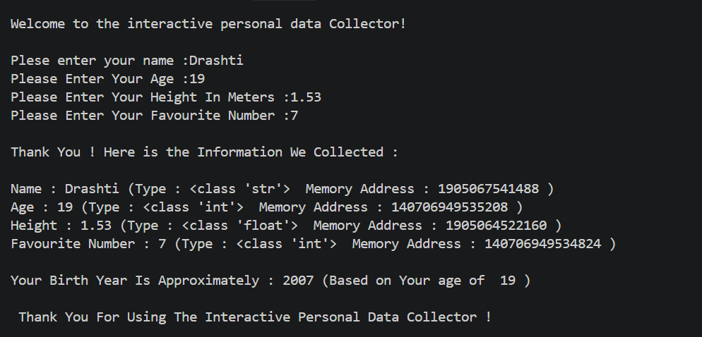

# 👩‍💻 Author

**Drashti Vadukul**
BCA Student | Learning Python, AI, ML & Data Science

---

# 🧑‍💻 Interactive Personal Data Collector

The **Interactive Personal Data Collector** is a beginner-friendly **Python console-based project** that collects basic information from the user and displays the collected information in a structured format.

This project is created to practice fundamental Python concepts such as **input/output, data types, type conversion, variables, built-in functions, arithmetic operations, and formatted output**.

The program also displays the **data type** and **memory address** of each collected value using Python's `type()` and `id()` functions.

---

## 🎯 Project Objective

The main objective of this project is to understand how Python can:

* Take information from the user.
* Store information in variables.
* Convert input into different data types.
* Display the type of stored data.
* Display the memory address of objects.
* Perform simple calculations.
* Display meaningful information through console output.

---

# ✨ Features

The program provides the following features:

### 🔹 1. User Name Input

The program asks the user to enter their name.

```python
name = input("Plese enter your name :")
```

The `input()` function takes the user's name as a **string**.

---

### 🔹 2. Age Input

The program asks the user to enter their age.

```python
age = int(input("Please Enter Your Age :"))
```

The `input()` function normally returns a string, so `int()` is used to convert the entered value into an **integer**.

---

### 🔹 3. Height Input

The program asks the user to enter their height in meters.

```python
height = float(input("Please Enter Your Height In Meters :"))
```

The `float()` function converts the entered value into a **floating-point number**.

Example:

```text
1.65
```

---

### 🔹 4. Favourite Number

The program also asks the user to enter their favourite number.

```python
num = int(input("Please Enter Your Favourite Number :"))
```

The entered value is converted into an integer using `int()`.

---

# 🧠 Python Concepts Used

This project covers several important Python fundamentals.

## 1. `print()`

The `print()` function is used to display information on the screen.

Example:

```python
print("Welcome to the interactive personal data Collector!")
```

It displays a welcome message to the user.

---

## 2. `input()`

The `input()` function is used to take information from the user.

Example:

```python
name = input("Plese enter your name :")
```

The entered value is stored inside the `name` variable.

---

## 3. Variables

Variables are used to store values.

This project uses:

```python
name
age
height
num
birth_year
```

Each variable stores different information.

---

## 4. Type Conversion

The project demonstrates conversion of user input into different data types.

### String

```python
name = input(...)
```

### Integer

```python
age = int(input(...))
```

### Float

```python
height = float(input(...))
```

### Integer

```python
num = int(input(...))
```

This helps demonstrate how the same `input()` function can be combined with different conversion functions.

---

# 🔍 Data Types Used

| Variable     | Data Type | Example     |
| ------------ | --------- | ----------- |
| `name`       | `str`     | `"Drashti"` |
| `age`        | `int`     | `21`        |
| `height`     | `float`   | `1.65`      |
| `num`        | `int`     | `7`         |
| `birth_year` | `int`     | `2005`      |

---

# 🧩 Built-in Functions Used

This project uses some useful Python built-in functions.

## `type()`

The `type()` function tells us the data type of a value.

Example:

```python
type(name)
```

Possible output:

```text
<class 'str'>
```

Similarly:

```python
type(age)
```

returns:

```text
<class 'int'>
```

---

## `id()`

The `id()` function returns the identity of a Python object.

Example:

```python
id(name)
```

The returned number represents the object's identity during its lifetime.

> Note: The value returned by `id()` can be different each time the program runs.

---

# 🧮 Birth Year Calculation

The program calculates an approximate birth year using:

```python
birth_year = 2026 - age
```

For example, if the user enters:

```text
Age = 21
```

The program calculates:

```text
2026 - 21 = 2005
```

Therefore:

```text
Your Birth Year Is Approximately : 2005
```

### ⚠️ Important Note

This is an **approximate birth year** because the calculation only uses the user's age and does not consider whether their birthday has already occurred in 2026.

---

# 🖥️ Sample Program Execution

```text
Welcome to the interactive personal data Collector!

Plese enter your name : Drashti
Please Enter Your Age : 21
Please Enter Your Height In Meters : 1.65
Please Enter Your Favourite Number : 7

Thank You ! Here is the Information We Collected :

Name : Drashti (Type : <class 'str'> Memory Address : 123456789)
Age : 21 (Type : <class 'int'> Memory Address : 123456790)
Height : 1.65 (Type : <class 'float'> Memory Address : 123456791)
Favourite Number : 7 (Type : <class 'int'> Memory Address : 123456792)

Your Birth Year Is Approximately : 2005 (Based on Your age of 21)

Thank You For Using The Interactive Personal Data Collector !
```

> The memory address values shown above are examples. The actual values returned by `id()` may be different each time the program runs.

---

# 📋 Program Flow

The program works in the following sequence:

```text
Start
  ↓
Display Welcome Message
  ↓
Ask for Name
  ↓
Ask for Age
  ↓
Ask for Height
  ↓
Ask for Favourite Number
  ↓
Display Collected Information
  ↓
Display Data Types
  ↓
Display Object IDs
  ↓
Calculate Approximate Birth Year
  ↓
Display Birth Year
  ↓
Display Thank You Message
  ↓
End
```

---

# 📚 What I Learned

Through this project, I practiced:

* ✅ Python `print()` function
* ✅ Python `input()` function
* ✅ Variables
* ✅ Strings
* ✅ Integers
* ✅ Floating-point numbers
* ✅ Type conversion
* ✅ `type()` function
* ✅ `id()` function
* ✅ Arithmetic operations
* ✅ User input handling
* ✅ Console-based programming
* ✅ Basic program flow
* ✅ Displaying structured output

---

# 🚀 Future Improvements

This project can be improved further by adding:

* 🔹 Input validation
* 🔹 Error handling using `try-except`
* 🔹 Date of birth input
* 🔹 More personal information
* 🔹 Age calculation from date of birth
* 🔹 Height conversion into centimeters
* 🔹 BMI calculation
* 🔹 A graphical user interface using Tkinter
* 🔹 Saving collected information into a file
* 🔹 Storing information in a database

---

# 🛠️ Technologies Used

* **Programming Language:** Python
* **Development Environment:** Visual Studio Code
* **Project Type:** Console-Based Application

---

# 📁 Project Structure

```text
Interactive-Personal-Data-Collector/
│
├── Personal_Data_Collector.py
├── README.md
└── Output/
    └── output-screenshot.png
```

---

# 🎓 Project Level

**Beginner / Fundamental Python Project**

This project is designed as a practice project for learning the basic concepts of Python programming.

---

# 👩‍💻 About the Author

**Drashti Vadukul**

I am a BCA student currently learning **Python, AI, Machine Learning, and Data Science**. This project is part of my Python fundamentals learning journey and helps me build a strong foundation in programming concepts.

---

# ⭐ Conclusion

The **Interactive Personal Data Collector** is a simple but useful Python project for understanding the fundamentals of user input, variables, data types, type conversion, built-in functions, and basic calculations.

It demonstrates how basic Python concepts can be combined to create an interactive console application.

---

⭐ **Thank you for visiting this project!**

